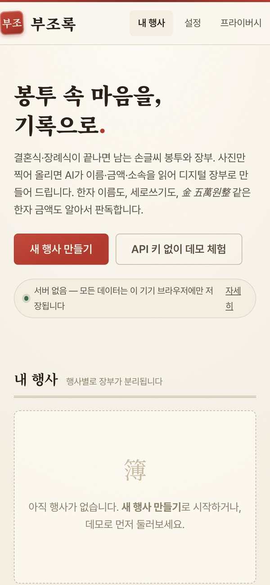

<div align="center">

# 부조록 (Bujorok)

**봉투 속 마음을, 기록으로.**

축의금·부의금 봉투와 장부를 촬영하면 AI가 디지털 장부로 만들어 주는 완전 정적 웹앱


<a href="https://inno-hi-inc.github.io/bujorok/"></a>&nbsp;<a href="https://inno-hi-inc.github.io/bujorok/"></a>

<sub>왼쪽: 데모 모드(샘플 데이터 20건) 장부 화면 · 오른쪽: 모바일 첫 화면</sub>

**[바로 써보기](https://inno-hi-inc.github.io/bujorok/)** · API 키 없이 데모 모드로 전체 플로우 체험 가능

</div>

---

결혼식·장례식이 끝난 뒤 남는 손글씨 축의금·부의금 봉투와 장부를 폰으로 촬영해 올리면, AI가
이름·금액·소속을 인식해 디지털 장부로 만들어 주는 도구입니다. 한자 이름 음차, 세로쓰기,
`金 五萬원整` 같은 한자 금액까지 판독합니다.

**프라이버시가 핵심입니다.** 서버가 없는 완전 정적 웹앱으로, 모든 데이터(장부·사진 썸네일·API
키·라이선스)는 사용자의 브라우저(IndexedDB / localStorage)에만 저장됩니다. AI 인식 시에만
압축된 이미지가 브라우저에서 Anthropic API로 **직접** 전송됩니다.

## 주요 기능

| 기능 | 무료 | 프리미엄 |
| --- | --- | --- |
| 행사 관리 (결혼식/장례식/돌잔치/기타, 행사별 장부 분리) | ✓ | ✓ |
| AI 봉투·장부 인식 (BYOK — 내 Claude API 키 사용) | 행사당 30건 | 무제한 |
| 검수 테이블 (인라인 편집, 원본 사진 참조, 낮은 신뢰도 하이라이트) | ✓ | ✓ |
| 유사 이름 중복 병합 제안 (예: "김철수" ↔ "金哲洙") | ✓ | ✓ |
| 통계 (총액·건수, 관계별 도넛, 금액대 분포 — 장례식은 무채색 톤) | ✓ | ✓ |
| CSV 내보내기 | ✓ | ✓ |
| 서식 적용 엑셀(.xlsx) 내보내기 (SheetJS) | — | ✓ |
| 관계·행사 유형별 존댓말 답례 문자 일괄 생성 + AI 다듬기 | — | ✓ |
| 데모 모드 (API 키 없이 샘플 20건으로 전체 플로우 체험) | ✓ | — |

- AI 모델: 기본 `claude-sonnet-5`, 설정에서 `claude-haiku-4-5-20251001` 선택 가능
- 이미지는 브라우저 canvas에서 최대 변 1568px 리사이즈 + JPEG 압축 후 전송 (장당 약 10~30원)

## 로컬 실행

```bash
npm install
npm run dev        # http://localhost:5173
```

프로덕션 빌드:

```bash
npm run build      # 타입 체크(tsc) + vite build → dist/
npm run preview    # 빌드 결과 미리보기
```

## 배포 (GitHub Pages)

1. GitHub 저장소를 만들고 `main` 브랜치에 push 합니다.
2. 저장소 **Settings → Pages → Build and deployment**에서 Source를 **GitHub Actions**로
   설정합니다.
3. `main`에 push 하면 `.github/workflows/deploy.yml`이 자동으로 빌드·배포합니다.

`vite.config.ts`의 `base: './'` + HashRouter 조합이라 저장소 하위 경로
(`https://<user>.github.io/<repo>/`)에서도 그대로 동작합니다.

## 프리미엄 라이선스 발급 (판매자용)

라이선스는 Ed25519 오프라인 서명으로 검증되며 서버가 필요 없습니다.
키 포맷: `BUJO-<base64url(JSON payload)>-<base64url(signature)>`

```bash
# 1) 최초 1회 — 키쌍 생성 (licenses/keypair.json은 gitignore, 절대 커밋 금지)
node scripts/gen-license.mjs init

# 2) 판매할 때마다 — 키 발급
node scripts/gen-license.mjs issue --to 홍길동 --plan lifetime
node scripts/gen-license.mjs issue --to 홍길동 --plan event
node scripts/gen-license.mjs issue --to 홍길동 --plan lifetime --exp 2027-12-31
```

- `init`은 공개키를 `src/license/publicKey.ts`에 자동 기록합니다 (커밋 대상).
- `--plan event`(행사 1회권)는 구매자가 프리미엄 기능을 처음 사용한 행사에 귀속됩니다.
- 발급된 키를 구매자 이메일로 보내면, 구매자는 **설정 → 프리미엄 라이선스**에 입력해 활성화합니다.
- 운영 절차·가격·환불 정책은 [SALES.md](./SALES.md) 참고.

**주의:** `licenses/keypair.json`(비밀키)을 잃어버리면 기존 라이선스는 유효하지만 새 키를 발급할 수
없고, 재생성하면 기존 키가 전부 무효화됩니다. 안전한 곳에 백업하세요.

## 기술 스택

- Vite + React + TypeScript (완전 정적, 서버 없음)
- IndexedDB([idb](https://github.com/jakearchibald/idb)) — 행사/항목/썸네일 저장
- [@noble/ed25519](https://github.com/paulmillr/noble-ed25519) — 브라우저 라이선스 검증 (WebCrypto 비의존)
- [SheetJS(xlsx)](https://sheetjs.com/) — 엑셀 내보내기 (필요 시점에만 동적 로드)
- Anthropic Messages API 직접 호출 (`anthropic-dangerous-direct-browser-access` 헤더, BYOK)
- 디자인: 한지 질감 미색(#FAF6EF) + 먹색 타이포, Noto Serif KR + Pretendard,
  결혼(진홍)/장례(먹회색) 테마 전환

## 라이선스 (소프트웨어)

개인 프로젝트 — 필요 시 라이선스 조항을 추가하세요.

---

<div align="center">
<sub>Made by <a href="https://github.com/khwee2000">김민수 (@khwee2000)</a> · <a href="https://github.com/INNO-HI-Inc">INNO-HI</a></sub>
</div>
